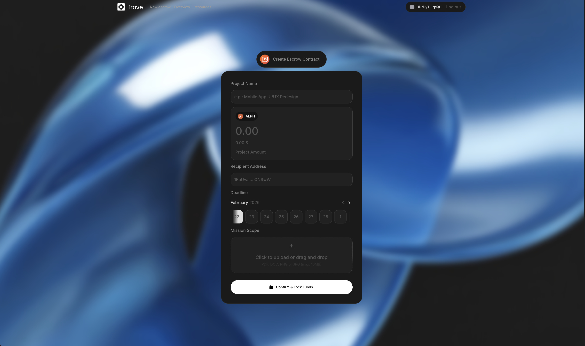
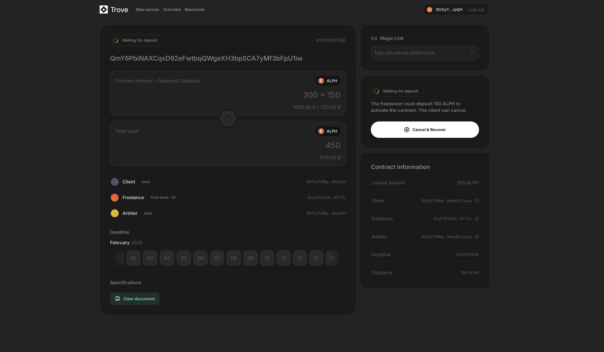
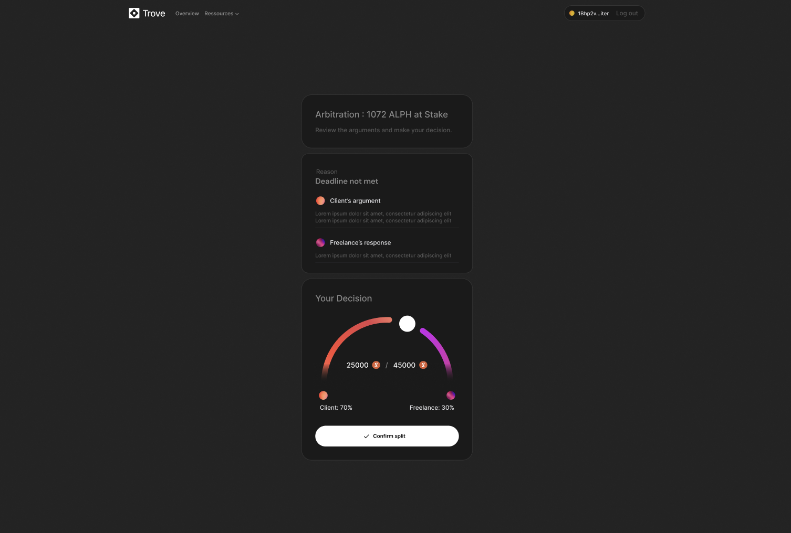

<p align="center">
  <picture>
    <source media="(prefers-color-scheme: dark)" srcset="app/public/logo-light.svg">
    <source media="(prefers-color-scheme: light)" srcset="app/public/logo-dark.svg">
    
  </picture>
</p>

<p align="center">
  <strong>Trustless escrow for freelancers. Zero commission. Zero risk. Built on Alephium.</strong>
</p>

---

## Demo

▶️ [**Watch the full demo on Loom**](https://www.loom.com/share/a1644ce44dc8466bb1ea11b79bc2f71d)

<p align="center">
  
</p>

<p align="center">
  
</p>

<p align="center">
  
</p>

---

## The Problem

1.57 billion freelancers worldwide. Most have no contract, no protection, no recourse. Just blind trust.

A company in Berlin finds a developer in Lagos. He's the right person for the job. But sending $5,000 in crypto to a stranger on the other side of the world? Nobody signs that wire. So they go through a platform — Upwork, Malt, Fiverr — and hand over 10–20% on every single transaction. For a freelancer billing $50k/year, that's $5,000–$10,000 gone. Every year. Not for a better service. Just for the illusion of safety.

And the freelancer who skips the platform? He delivers. He sends his invoice. He waits. One week. Two weeks. He follows up. No response. The client disappears. 80 hours of work — a gift.

**Too expensive, or too dangerous. There's nothing in between.**

## The Solution

**Trove is the in-between.**

A peer-to-peer escrow protocol where the client locks their payment, the freelancer locks a bond, and a smart contract enforces fairness. No middleman. No commission. No trust required. Just code that verifies proof.

When the work is delivered and validated, everything is released in a **single atomic transaction** — payment + bond go to the freelancer. One click. Done. And if things go wrong? An on-chain arbiter reviews the evidence and splits funds by percentage. Every decision is transparent, immutable, and auditable.

**No one is ever stuck:**

| Situation | What happens |
|-----------|-------------|
| Client validates | Freelancer gets payment + bond. Trust score increases. |
| Client disappears | Auto-claim after 48h past deadline. Freelancer gets everything. |
| Client cancels early | Full refund before freelancer accepts. No penalty. |
| Freelancer abandons | Client refunded. Freelancer gets bond back. Score decreases. |
| Dispute | Arbiter splits funds 0–100% with on-chain justification. |

---

## On-chain Reputation: Your Work Is Your Capital

Today, to be credible as a freelancer, you give 15% of your income to a platform. On Trove, **you build your own credibility. And nobody can take it away.**

The TrustRegistry contract stores every freelancer's trust score on-chain (0–100, starting at 50). The bond decreases as the score increases:

| Score | Bond | What it means |
|-------|------|---------------|
| 50 (new) | 50% of base | First gig. Unknown track record. |
| 70 | 30% | Proven. Several successful deliveries. |
| 90+ | 10% (floor) | Veteran. Minimal bond, maximum trust. |

Formula: `bond = baseCollateral * max(10, 100 - score) / 100`

A new freelancer deposits a full bond. After 5 missions, it drops. After 20, it's almost symbolic. They didn't send a resume. They didn't beg a platform to verify them. They just did the work — and the blockchain remembered.

This isn't a profile with stars that a platform can delete. It's a **portable, permanent, on-chain asset**. Your reputation becomes your capital.

---

## Why Alephium — And Why This Couldn't Exist Anywhere Else

We didn't pick Alephium by accident. **We needed it.**

| | Ethereum | Alephium |
|---|---|---|
| **Model** | Account-based. All contracts share global state. | **sUTXO**. Each escrow is an isolated UTXO with its own state. |
| **Isolation** | One bug can contaminate other contracts. Like every vault in a bank sharing the same lock. | Each vault has its own lock, its own key. **Mathematically isolated.** |
| **Atomicity** | Multi-step transactions. Intermediate states. Race conditions. | Multiple inputs → one output → one transaction. **All or nothing.** |
| **Security** | Reentrancy. Unlimited token approvals. Flashloans. | **Impossible by design.** The Asset Permission System eliminates these attack vectors at the VM level. |
| **Energy** | PoW / PoS | Proof of Less Work. **87% less energy** than classic PoW. |

Alephium's sUTXO model lets us build **Smart-UTXOs** — assets that carry their own release conditions. The escrow contract IS the vault. Not a pointer to a balance in a global ledger. The actual funds, locked, with code that defines exactly when and how they move.

The atomic multi-party exchange at the heart of Trove — client payment + freelancer bond consumed and redistributed in a single transaction — is the kind of operation that's fragile on account-based chains and **native on Alephium**. No intermediate state. No front-running. If any condition fails, nothing moves. This is the sUTXO model doing exactly what it was designed to do.

In a world where blockchains are under regulatory pressure for their environmental impact, Trove runs on infrastructure that was built to be sustainable from day one. Same security as traditional PoW, 87% less energy. We don't ask freelancers to choose between decentralization and the planet.

**This is the level of security that freelancers deserve.**

---

## The Vision

Most hackathon escrow projects are simple token swaps. Button A, button B, swap. We built something different.

Trove is not a payment tool. It's **the trust layer for the future of work.** A protocol where:

- Any freelancer, anywhere, can work with any company, anywhere — without intermediaries, without permission, without fear.
- Reputation is earned on-chain, not rented from a platform. It's portable, permanent, and incensurable.
- Every completed mission makes the next one easier. Your history IS your credibility.
- Disputes are resolved transparently, on-chain, with verifiable evidence — not by someone behind a desk you'll never see.

We didn't just build a demo. We built the infrastructure for trustless collaboration at global scale. And we built it on the only chain where it could exist exactly as it should.

---

## How It Works

```
Client                        Freelancer                      Arbiter
  |                              |                               |
  |── create escrow ──────────>  |                               |
  |   (locks 1000 ALPH)         |                               |
  |                              |                               |
  |                              |── accept + deposit bond ───>  |
  |                              |   (100 ALPH collateral)       |
  |                              |                               |
  |                              |── deliver(IPFS link) ──────>  |
  |                              |                               |
  |── release() ──────────────>  |                               |
  |   1100 ALPH → freelancer     |                               |
  |   (atomic, single tx)        |                               |
  |                              |                               |
  |   Trust score +5             |                               |
  |   Next bond reduced          |                               |
```

---

## Architecture

### Smart Contracts (Ralph)

**`TrustRegistry`** — Persistent on-chain reputation. One instance, stores all scores.

**`Escrow`** — One per mission. 13 fields, 8 functions, full dispute lifecycle.

```
Created ──> Active ──> Delivered ──> Done (release / autoClaim)
   |           |  |         |
   |           |  |         └──> Dispute ──> Done (resolve)
   |           |  |
   |           |  └──> Done (refundByFreelancer)
   |           |
   |           └──> Dispute ──> Done (resolve)
   |
   └──> Done (cancelByClient)
```

**9 TxScripts** — Alephium's native transaction scripts for frontend interaction:
`AcceptAndDeposit` · `Deliver` · `ReleasePayment` · `OpenDispute` · `SubmitEvidence` · `ResolveDispute` · `RefundByFreelancer` · `CancelEscrow` · `ClaimAfterDeadline`

### Tech Stack

| Layer | Technology |
|-------|------------|
| Blockchain | Alephium (sUTXO, Proof of Less Work) |
| Smart contracts | Ralph (.ral) |
| Frontend | Next.js 14 · React 18 · TypeScript |
| Wallet | Alephium Extension (@alephium/web3-react) |
| Specs storage | IPFS via Pinata |
| SDK | @alephium/web3 · @alephium/cli |
| Tests | Jest · @alephium/web3-test |
| Infra | Docker Compose (node + explorer + PostgreSQL) |

### Monorepo

```
trove/
├── contracts/            # Ralph contracts + deploy scripts + tests
│   ├── contracts/        # escrow.ral · trust_registry.ral · escrow_scripts.ral
│   ├── scripts/          # Deploy scripts (TrustRegistry, then Escrow)
│   ├── test/             # Unit tests
│   └── artifacts/        # Auto-generated TypeScript bindings
├── app/                  # Next.js frontend
│   ├── src/components/   # CreateEscrow · ContractView · ArbitrationView
│   └── src/utils/        # Alephium web3 integration
├── alephium-stack/       # Docker Compose for local devnet
└── docs/                 # Technical documentation
```

---

## Run It

### Prerequisites

- [Node.js](https://nodejs.org/) >= 18
- [Yarn](https://classic.yarnpkg.com/) v1 (`npm install -g yarn`)
- [Docker](https://www.docker.com/) + Docker Compose

### Setup

```bash
git clone <repo-url> && cd HackatonDeauphine
yarn install
cp app/.env.example app/.env.local
yarn go
```

> **Note on `.env.example`:** Yes, we know you're not supposed to commit API keys in a repo. These are shared Pinata (IPFS) credentials for the hackathon — they're free-tier, non-sensitive, and it saves reviewers from setting up their own. Don't do this in production.

`yarn go` starts the Docker devnet, compiles Ralph contracts, deploys them, builds TypeScript bindings, and launches the frontend. Everything.

**http://localhost:3000** — you're live.

### Testnet

```bash
export PRIVATE_KEYS="your_private_key"
yarn go:testnet
```

Free tokens: [Alephium Faucet](https://faucet.testnet.alephium.org/)

### Commands

| Command | What it does |
|---------|-------------|
| `yarn go` | Full stack: devnet + compile + deploy + build + frontend |
| `yarn go:testnet` | Same, but deploys to testnet |
| `yarn dev:testnet` | Frontend on testnet (contracts already deployed) |
| `yarn devnet:start` | Start Docker devnet |
| `yarn devnet:stop` | Stop Docker devnet |
| `yarn compile` | Compile Ralph → artifacts |
| `yarn deploy` | Deploy contracts to devnet |
| `yarn build:contracts` | Build TypeScript bindings |
| `yarn test` | Run unit tests |
| `yarn dev` | Start frontend (port 3000) |

### Devnet services

| Service | URL |
|---------|-----|
| Alephium Node | http://127.0.0.1:22973 |
| API Docs | http://127.0.0.1:22973/docs |
| Block Explorer | http://localhost:23000 |

### Devnet wallet

Import into [Alephium Extension](https://alephium.org/#wallets) (custom network `http://127.0.0.1:22973`):

```
vault alarm sad mass witness property virus style good flower rice alpha viable evidence run glare pretty scout evil judge enroll refuse another lava
```

4 addresses, **4,000,000 ALPH** each.

---

## Troubleshooting

| Problem | Fix |
|---------|-----|
| `ENOENT` on artifacts | `rm contracts/.project.json && yarn compile` |
| `Can't resolve 'my-contracts'` | `yarn build:contracts && yarn install` |
| Deploy fails (connection) | `yarn devnet:start` |
| Empty addresses in frontend | `yarn setup && yarn dev` |
| Port already in use | `yarn devnet:stop` |

---

## Docs

- [**Contract API**](docs/CONTRACTS_API.md) — Every function, every parameter, every check
- [**Frontend Guide**](docs/FRONTEND_GUIDE.md) — How to talk to the contracts from React
- [**Alephium Onboarding**](docs/ALEPHIUM-TECHNICAL-ONBOARDING.md) — Ralph language & sUTXO model
- [**Implementation Plan**](PLAN.md) — Design decisions & architecture rationale

---

## License

MIT
